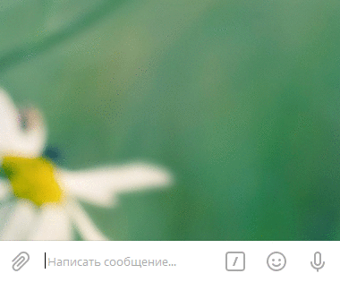

# Обработчик onClick

Исходный код находится 
[здесь](https://github.com/classtype/app.init/tree/master/examples/bot.onClick)

`$.Bot.onClick` — Слушает клик по кнопке со встроенной клавиатуры.

В примере ниже обработчик будет срабатывать на любой клик по кнопке.

```js
$.Bot.onStart(function() {
    this.send('Вы уверены, что хотите продолжить?', [
        ['Да','button_1'],
        ['Нет','button_2']
    ]);
});

$.Bot.onClick(function() {
    this.send(`Вы кликнули по кнопке:\n"${this.button_id}"`);
    this.complete();
});
```

Результат в Telegram:

<span class="img"></span>


Также можно задать на каждую кнопку отдельный обработчик.

```js {highlight:[8, 13]}
$.Bot.onStart(function() {
    this.send('Вы уверены, что хотите продолжить?', [
        ['Да','button_1'],
        ['Нет','button_2']
    ]);
});

$.Bot.onClick('button_1', function() {
    this.send('Вы выбрали "Да"');
    this.complete();
});

$.Bot.onClick('button_2', function() {
    this.send('Вы выбрали "Нет"');
    this.complete();
});
```

Результат в Telegram:

<span class="img"></span>


## Смотрите также

- [Клавиатура (обычная)](./bot.keyboard.md)
- [Клавиатура (встроенная)](./bot.inlineKeyboard.md)
- [this.send](./bot.this.send.md) — Отправляет сообщение от бота.
- [$.Bot.onText](./bot.onText.md) — Слушает текстовые сообщения.
- [$.Bot.onCommand](./bot.onCommand.md) — Слушает присланные команды.
- [$.Bot.onStart](./bot.onStart.md) — Слушает команду `/start`
- [$.Bot.onHelp](./bot.onHelp.md) — Слушает команду `/help`
- [$.Bot.onSettings](./bot.onSettings.md) — Слушает команду `/settings`
