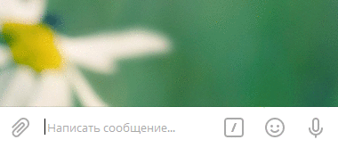

# Метод this.send

Исходный код находится 
[здесь](https://github.com/classtype/app.init/tree/master/examples/bot.this.send)


`this.send` — Отправляет сообщение от бота.

```js {highlight:[2]}
$.Bot.onStart(function() {
    this.send('Начинаю запуск...');
});
```

Результат в Telegram:

<span class="img"></span>


## Смотрите также

- [$.Bot.onStart](./bot.onStart.md) — Слушает команду `/start`
